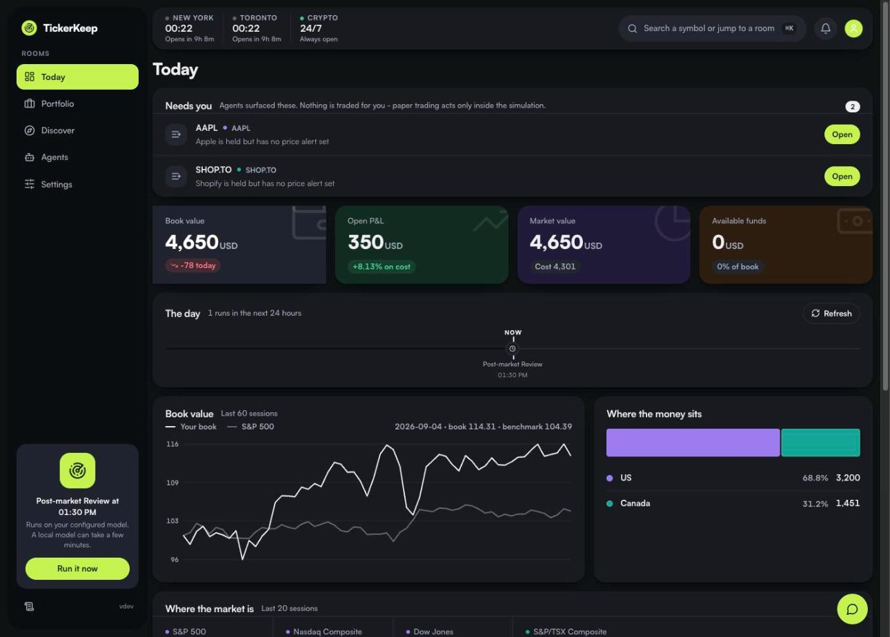
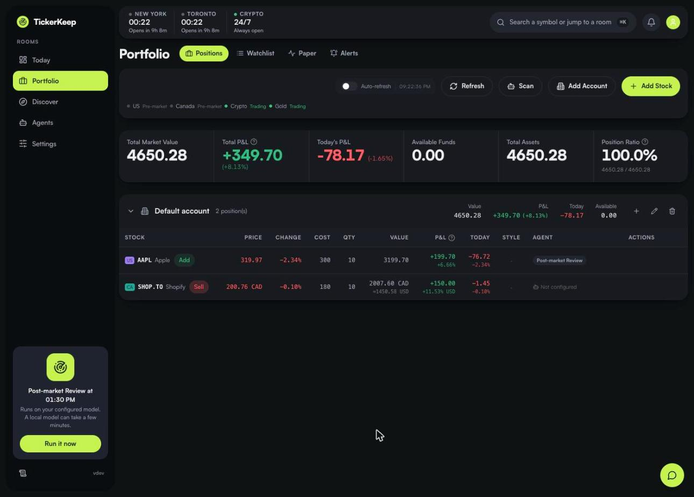
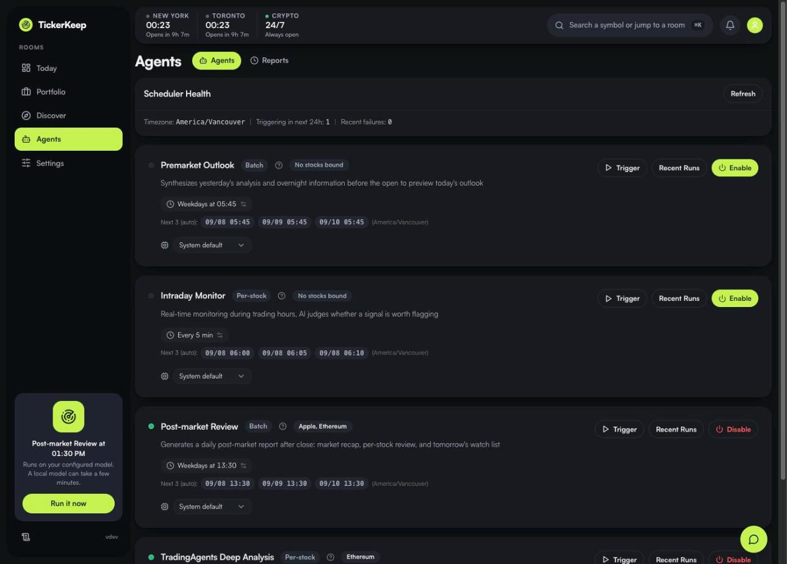
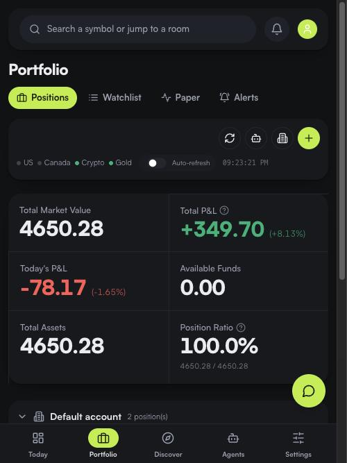

<div align="center">

# TickerKeep

**A self-hosted stock research assistant for US & Canadian markets.**

Track a portfolio, watch the tape, run scheduled AI analysts on your own model
keys, and paper-trade strategies — all on your own machine, with your data
staying in your own database.

[](LICENSE)
[](pyproject.toml)
[](frontend/package.json)
[](#quick-start)



</div>

---

## What it is

TickerKeep runs entirely on your hardware. It pulls market data, keeps your
positions, and — if you give it an API key for a model you already pay for —
runs scheduled agents that write you a pre-market outlook, monitor the session,
and produce a post-market review.

It is built for people who want to **own their stack**: no account, no
subscription, no vendor holding your portfolio, no telemetry.

**Scope is deliberately narrow.** US and Canadian equities are fully supported.
Crypto and gold are watchlist-only. Anything the data provider can't price is
shown as *unpriced* rather than guessed at.

## Screenshots

| Portfolio — multi-currency positions | Agents — scheduled analysts |
|---|---|
|  |  |

<div align="center">

<br><em>Responsive down to 390px.</em>
</div>

## Features

**Portfolio**
- Multiple accounts, positions and cash balances
- **Honest multi-currency valuation.** A CAD holding keeps its native value
  (`2007.60 CAD`) and shows the USD conversion separately (`≈1450.58 USD`) at a
  real fetched rate. If the FX rate is unavailable, you are told — no invented
  fallback rate, and no silently treating CAD as USD.
- **Missing is not zero.** An unpriced holding renders as unknown, never as a
  total loss. Partial totals are labelled partial.
- Benchmark comparison against the S&P 500, exposure by market

**Market data & watchlist**
- Quotes, candles and fundamentals through a pluggable provider layer
  (`packages/marketdata`)
- Symbol search across US and Canadian listings, including same-ticker
  cross-market cases (`AAPL` vs `AAPL.TO`) kept strictly apart
- Price/change/volume alert rules

**AI agents** *(optional — bring your own key)*
- Pre-market outlook, intraday monitor, post-market review, and a multi-agent
  deep-analysis pipeline
- Any OpenAI-compatible provider. Per-agent model selection with failover.
- **No default endpoint.** An unconfigured install sends your prompts nowhere.

**Paper trading**
- Strategy signals (trend-follow, MACD, momentum, …) drive a simulated book
- Equity curve, win rate, drawdown, per-strategy performance
- Simulation only — **no brokerage order is ever placed**

**Notifications** — Telegram, Discord, Bark, WeChat Work, DingTalk, webhooks
(via Apprise), with quiet hours, retry and de-duplication.

**MCP endpoint** — expose read-only quotes and positions to an MCP client using a
personal access token.

## Quick start

Requires Docker.

```sh
git clone https://github.com/The-code-giant/tickerkeep-core.git
cd tickerkeep-core
cp .env.example .env
docker compose -p tickerkeep build
docker compose -p tickerkeep up -d
```

Open **http://127.0.0.1:18080** and log in.

> [!IMPORTANT]
> Set `AUTH_USERNAME`, `AUTH_PASSWORD` and `JWT_SECRET` in `.env` **before the
> first start**. Until a password exists, TickerKeep does not require a login —
> which is harmless on a loopback bind and an open instance on any other. The
> credentials seed the account once; change the password from Settings afterwards.

The sample compose file binds to loopback only and creates its own Compose-managed
volume. `docker compose down` keeps your records; `down -v` deletes them.

Schedulers and update polling start **disabled**. Configure your providers,
models and notification channels first, then set `DISABLE_SCHEDULERS=0`.

### Configuration

| Variable | Purpose |
|---|---|
| `AUTH_USERNAME` / `AUTH_PASSWORD` | Seeds the account on first start. Ignored once an account exists |
| `JWT_SECRET` | Session signing key. Use a long random value; changing it logs everyone out |
| `AI_BASE_URL` / `AI_API_KEY` / `AI_MODEL` | OpenAI-compatible provider. **No default** — unset means AI features stay off |
| `DATA_DIR` | Database and runtime data (`/app/data` in Docker) |
| `TZ` | Scheduling timezone (default `America/Vancouver`) |
| `DISABLE_SCHEDULERS` | `1` to stop all background agent runs |
| `HTTP_PROXY` | Route outbound requests through a proxy |

Providers, models, agents and channels are also configurable from the Settings UI.

## Architecture

```
server.py            FastAPI entrypoint; serves the built frontend and the API
├── src/web/         Routes, SQLAlchemy models, JWT auth, SQLite database
├── src/agents/      Pre-market, intraday, post-market, chart, deep-analysis
├── src/collectors/  Quote / candle / news collection
├── src/core/        Scheduler, notifier, AI client, strategy signals,
│                    paper-trading engine
├── packages/        marketdata — provider layer (separate Python distribution)
├── prompts/         One prompt template per agent
└── frontend/        React + TypeScript + Vite (pnpm workspaces)
```

Backend: **Python 3.10+**, FastAPI, SQLAlchemy 2, APScheduler, SQLite.
Frontend: **Node 24**, pnpm 9.15.9, React, Tailwind, shadcn/ui.
API responses are wrapped as `{ code, data, message }`.

## Development

```sh
# Backend
pip install -r requirements.txt
python server.py                     # http://127.0.0.1:8000

# Frontend
cd frontend && pnpm install && pnpm dev
```

**Review UI changes in Docker, not the dev server** — the image builds the
frontend in stage 1, so a type error fails the build instead of shipping a
broken bundle.

## Testing

```sh
python -m pytest tests/ -q
```

Notifications are suppressed unless you pass `--notify`. The shared fixture
redirects installation paths before import, so tests never touch a real
configuration or database.

CI runs the test suite, the frontend type-check and build, and a Docker image
build. It runs on pull requests and manual dispatch only — **it never publishes
an image or deploys**, by design.

## What this is *not*

Being direct about the limits, because a research tool that overstates itself is
worse than useless:

- **Not financial advice.** Agent output is generated text. Verify everything.
- **Paper trading is a simulation.** No broker is connected and no order is ever
  placed anywhere.
- **AI features need your own API key** and cost whatever your provider charges.
- **Market data is best-effort** from public sources. It is not exchange-grade,
  and it is not licensed for redistribution.
- **Single-tenant.** There is no multi-user isolation, billing or hosted mode
  here. Run it for yourself, behind your own network boundary.
- **Not audited.** Read the code before trusting it with anything that matters.

## Contributing

See [CONTRIBUTING.md](CONTRIBUTING.md). Issues and pull requests are welcome.
Please run the test suite before opening a PR.

## License

[MIT](LICENSE) — Copyright (c) 2026 The Code Giant.

TickerKeep began as a fork of an MIT-licensed upstream project. That author's
notice is reproduced in full in [NOTICE](NOTICE), which ships with every copy,
as the MIT License requires.

Third-party components, their licences and required attributions are recorded in
[NOTICE-THIRD-PARTY.md](NOTICE-THIRD-PARTY.md) and [NOTICE](NOTICE). Charts are
rendered with TradingView's [lightweight-charts](https://github.com/tradingview/lightweight-charts).
